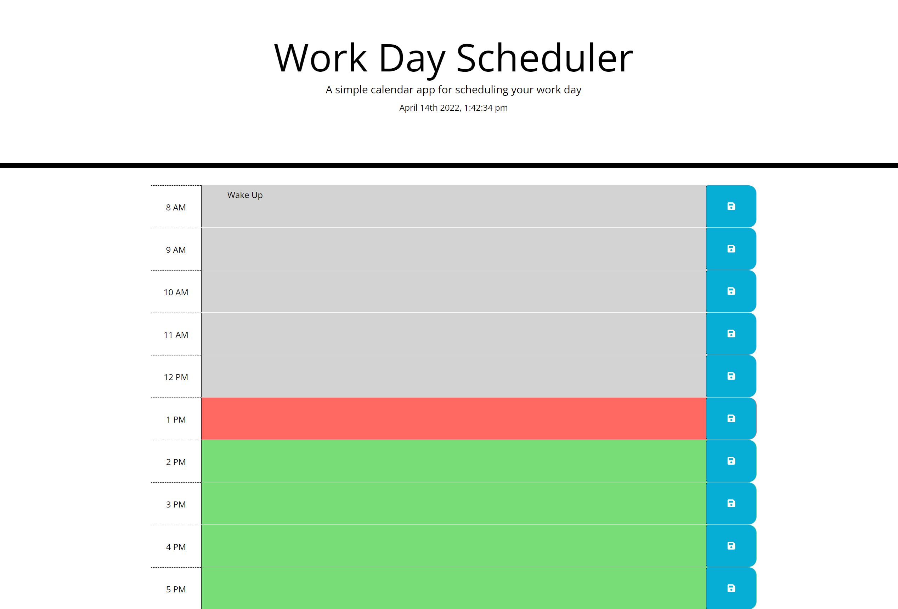

# Work-Day-Scheduler

This assignment is supposed to store information locally to plan out the users day, hour by hour.

I can't get the local storage to function properly, But I was able to make it so the colors change accordingly to the current time and hour of the day for past / futute / present.

I just really wanted to submit this assignment seeing as it is really late. I will be attempting to come back to this for re-submission.

<!-- Links -->
https://github.com/PolishMustard624853/Work-Day-Scheduler

https://polishmustard624853.github.io/Work-Day-Scheduler/

<!-- Screenshot -->
